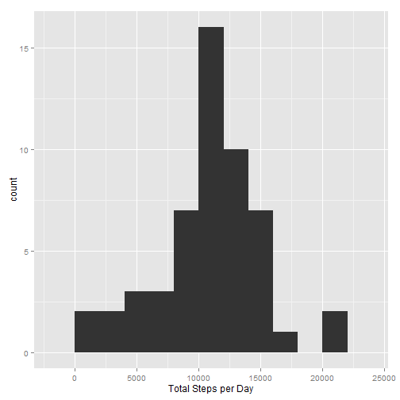
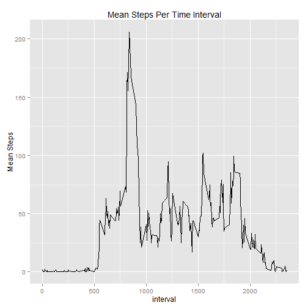
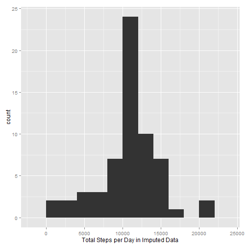
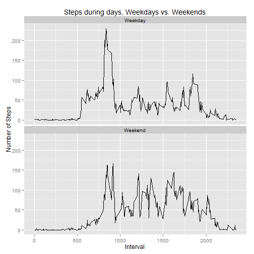

# Reproducible Research: Peer Assessment 1

## Loading and preprocessing the data
The following code loads the data, assuming the data is in the working directory of R


```r
library(plyr)
library(reshape2)
library(ggplot2)
library(lubridate)

#load data and melt data frame for easier analysis, convert dates
activitydata <- read.csv("activity.csv", na.strings = "NA")
activitydata[,2] <- ymd(activitydata[,2])
```

## What is mean total number of steps taken per day?

Histogram of total number of steps per day


```r
#Calculate sum of steps per day --PART2--
sumdata <- ddply(activitydata, .(date), summarize, sumsteps = sum(steps))

#plot total steps per day --PART2--
totalhist <- ggplot(sumdata, aes(sumsteps))
totalfinal <- totalhist + geom_histogram(binwidth = 2000) + labs(x = "Total Steps per Day")
print(totalfinal)
```

 

Mean of total steps per day


```r
meansteps <- mean(sumdata$sumsteps, na.rm = TRUE)
meansteps
```

```
## [1] 10766
```

Median of total steps per day


```r
mediansteps <- median(sumdata$sumsteps, na.rm = TRUE)
mediansteps
```

```
## [1] 10765
```

## What is the average daily activity pattern?

Mean Steps Per Time Interval Plot


```r
#plot total steps --PART 3
fivemindata <- ddply(activitydata, 
                       .(interval),
                       summarize,
                       meansteps = mean(steps, na.rm=TRUE))

#plot 5 min intervals
fivemin <- ggplot(fivemindata, aes(interval, meansteps))
fivefinal <- fivemin + geom_line() + labs(title = "Mean Steps Per Time Interval") + labs(y = "Mean Steps")
print(fivefinal)
```

 

Time Interval with highest mean steps across study period


```r
fivelogical <- (fivemindata$meansteps == max(fivemindata$meansteps))
maxinterval <- fivemindata$interval[fivelogical] #interval with max mean steps
maxinterval
```

```
## [1] 835
```


## Imputing missing values

Total NA in dataset


```r
#number of NA values --PART 4
nasteps <- length(which(is.na(activitydata$steps)==T))
nasteps
```

```
## [1] 2304
```

I chose to fill missing intervals in dataset with the mean of that interval across all days.
This creates a new data frame called imputedata


```r
#use interval mean for imputation of missing value --PART 4
imputedata <- activitydata
counter <- 1
while( counter <= nrow(imputedata)) {
    activerow <- imputedata[counter,]
    if(is.na(activerow$steps)) {
            complogical <- (fivemindata$interval == activerow$interval)
            fiveminrow <- fivemindata[complogical,]
            imputedata[counter,]$steps <- fiveminrow$meansteps
    }
    counter <- counter + 1
}
```

Histogram of imputed data


```r
#Calculate sum of steps per day --PART2--
sumdata2 <- ddply(imputedata, .(date), summarize, sumsteps = sum(steps))

#plot total steps per day --PART2--
totalhist2 <- ggplot(sumdata2, aes(sumsteps))
totalfinal2 <- totalhist2 + geom_histogram(binwidth = 2000) + labs(x = "Total Steps per Day in Imputed Data")
print(totalfinal2)
```

 

Mean of total steps per day in imputed data


```r
meansteps2 <- mean(sumdata2$sumsteps, na.rm = TRUE)
meansteps2
```

```
## [1] 10766
```

Median of total steps per day in imputed data


```r
mediansteps2 <- median(sumdata2$sumsteps, na.rm = TRUE)
mediansteps2
```

```
## [1] 10766
```

These values do not differ from the first part of asignment. The missin data does not change the median or the mean, but it does change the distribution of the data points significantly.

## Are there differences in activity patterns between weekdays and weekends?


```r
library(plyr)
library(reshape2)
library(ggplot2)
library(lubridate)

endorday <- function (x) {
    dayofweek <- wday(x, label = TRUE, abbr = FALSE)
    if (dayofweek >= "Monday" & dayofweek <= "Friday") {
        weekpart <- "Weekday"
    }
    else {
        weekpart <- "Weekend"
    }
    return(weekpart)
}

partofweek <- sapply(imputedata[,2], endorday)
imputedata2 <- cbind(imputedata, partofweek)
fiveminday <- ddply(imputedata2, 
                    .(interval, partofweek),
                    summarize,
                    meansteps = mean(steps, na.rm=TRUE))
daygraph <- ggplot(fiveminday, aes(interval, meansteps))
dayfinal <- daygraph + geom_line() + facet_wrap( ~ partofweek, nrow = 2, ncol = 1) + labs(title = "Steps during days, Weekdays vs. Weekends") + labs(y = "Number of Steps") + labs(x = "Interval")

print(dayfinal)
```

 

During weekdays, step count is greater in the morning, but on weekends, step counts are greater during the middle of the day.
